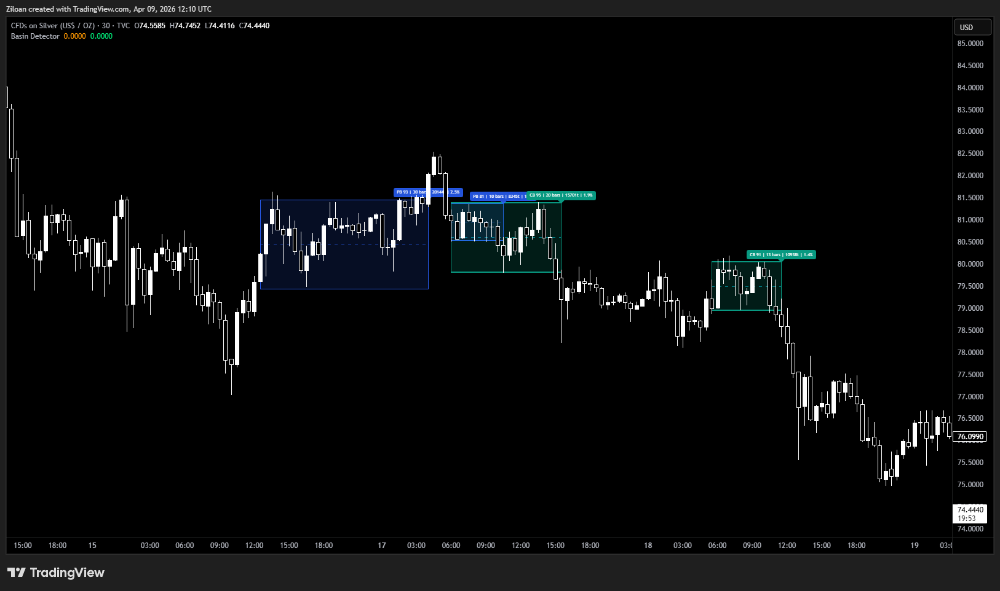
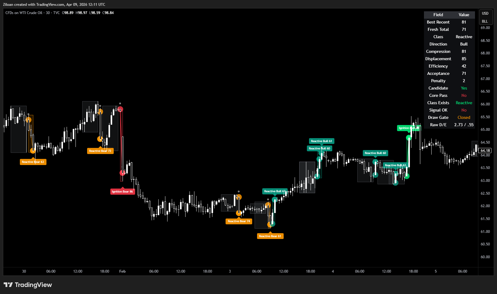
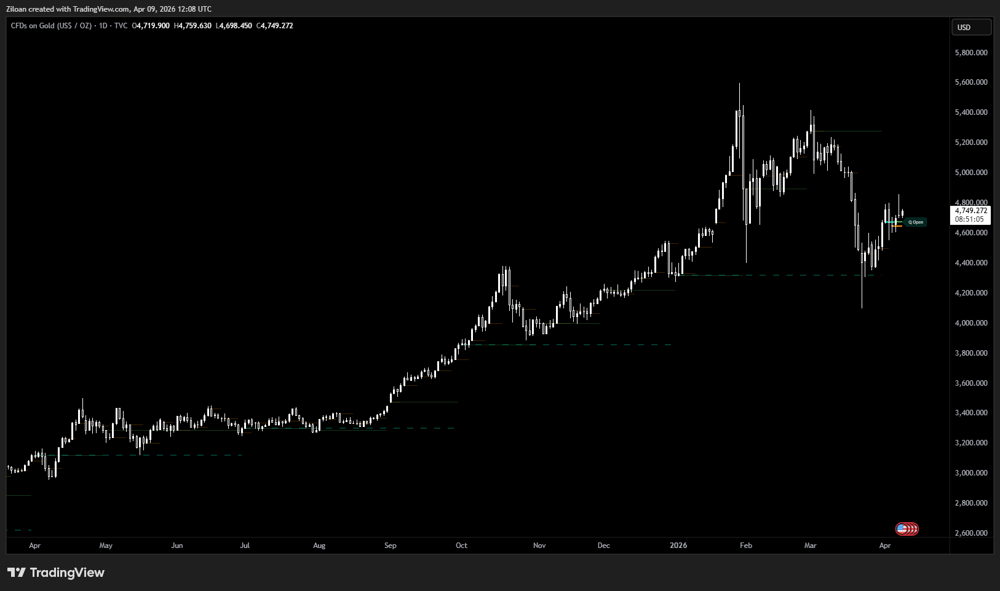
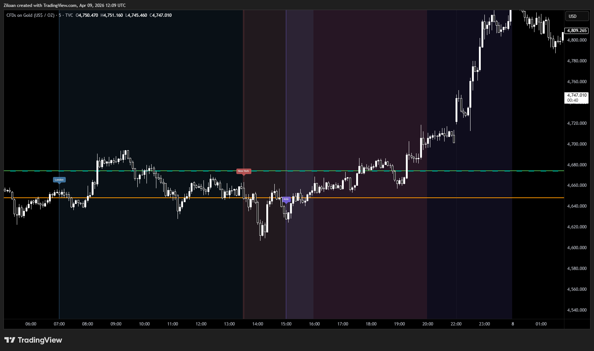
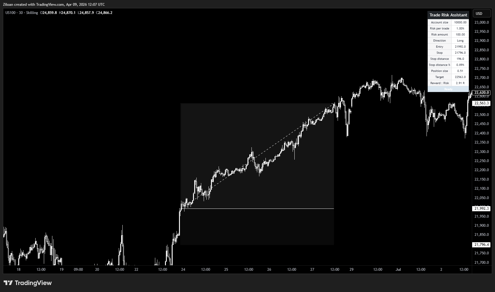
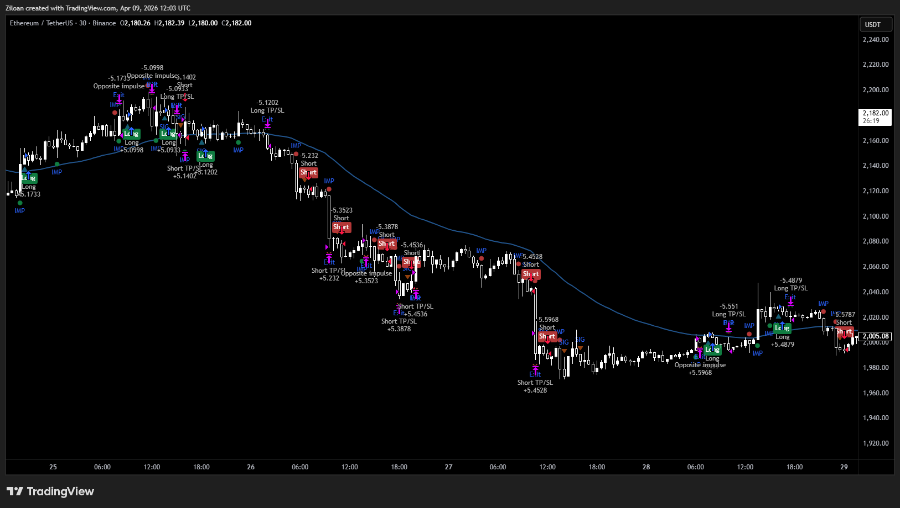
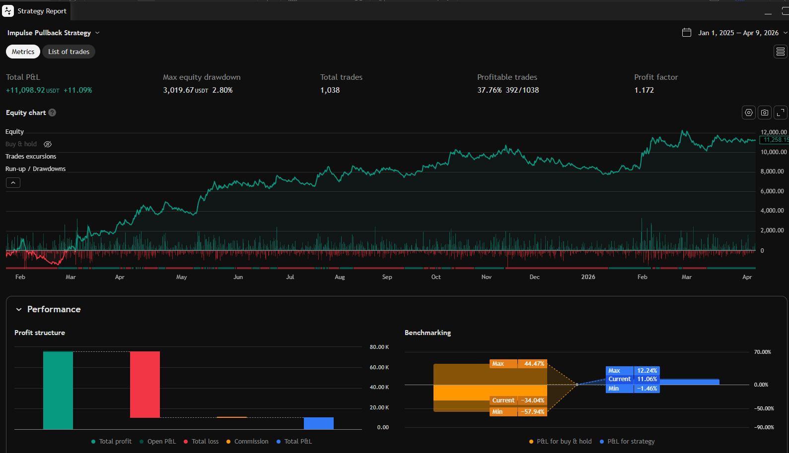

# TradingView Pine Script Tools


Custom TradingView indicators, strategies, and utilities built in **Pine Script v6** for market structure analysis, momentum detection, session mapping, and trade risk planning.

This repository is part of my public portfolio as a **Pine Script developer**. The focus is on clean, practical tools that can be adapted for custom client work such as indicators, strategies, alerts, dashboards, and trader utilities.

---

# System Workflow

Most tools in this repository follow a similar signal-generation architecture.

Market Price Data (OHLC)  
↓  
Indicator Logic  
(pattern detection / statistical analysis / session logic)  
↓  
Signal Conditions  
↓  
Chart Visualization  
(levels / zones / labels / markers)  
↓  
Trading Alerts or Strategy Rules  

The scripts transform raw price data into structured chart information that traders can use for analysis, decision making, or automation.

---

# Toolkit Philosophy

The tools in this repository can be combined into a simple workflow:

Market Structure  
↓  
Momentum / Expansion  
↓  
Context (sessions / HTF levels)  
↓  
Risk Management  

Example indicator stack:

Liquidity Compression Detector  
→ identify consolidation zones  

Market Impulse Detector  
→ identify expansion candles  

Market Structure Detector  
→ confirm trend continuation or structural shift  

Trade Risk Assistant  
→ plan position size and risk  

This modular design reflects how custom TradingView tools are often built for professional trading workflows.

---

# Indicators

## Liquidity Compression Detector

Detects horizontal compression zones where price repeatedly oscillates within a narrow range. These structures can help identify consolidation and potential breakout areas.



**Highlights**

- Pivot-based range detection  
- Equality tolerance controls  
- Dynamic zone visualization  
- Historical structure review  

Documentation:  
docs/liquidity-compression-detector.md

---

## Market Impulse Detector

Highlights strong directional candles and short impulse sequences using a multi-factor momentum model. Designed to help identify expansion phases following consolidation or low-volatility conditions.



**Highlights**

- Volatility-aware impulse detection  
- Composite scoring model  
- Directional impulse classification  
- Visual momentum markers  

Documentation:  
docs/market-impulse-detector.md

---

## Market Structure Detector

Identifies structural turning points and trend events using pivot-based market structure logic.

The indicator tracks swing highs and lows, classifies structural pivots, and marks Break of Structure (BOS) and Change of Character (CHoCH) events.


**Highlights**

- Swing high / swing low detection  
- HH / HL / LH / LL classification  
- BOS and CHoCH structure events  
- Dynamic structure level visualization  
- Optional continuation BOS filtering  

Documentation:  
docs/market-structure-detector.md

---

## Market Sessions & HTF Levels

Displays key market sessions and higher-timeframe reference levels directly on the chart. Useful for traders who rely on session structure and major opens as contextual guides.





**Highlights**

- Session overlays  
- Daily / weekly / monthly / quarterly levels  
- Historical level display options  
- Intraday chart utility  

Documentation:  
docs/market-sessions-htf-levels.md

---

## Trade Risk Assistant

A lightweight chart utility for calculating position size based on account size, percentage risk, and trade stop distance.



**Highlights**

- Account-based risk sizing  
- Fast chart-side calculation  
- Clear visual output  
- Adaptable utility indicator  

Documentation:  
docs/trade-risk-assistant.md

---

# Strategies

## Market Impulse Pullback Strategy

A demonstration strategy showing how momentum-style indicator logic can be converted into systematic entry and exit rules.

The strategy detects impulse candles, waits for a pullback, and enters when price resumes in the original direction.





**Highlights**

- ATR-based impulse detection  
- Pullback entry logic  
- Optional EMA trend filter  
- Fixed reward-to-risk exits  
- Cross-symbol compatible position sizing  

Documentation:  
docs/market-impulse-pullback-strategy.md

---

# Repository Structure

```
tradingview-pinescript-tools/

├── indicators/
│   ├── liquidity-compression-detector.pine
│   ├── market-impulse-detector.pine
│   ├── market-structure-detector.pine
│   ├── market-sessions-htf-levels.pine
│   └── trade-risk-assistant.pine
│
├── strategies/
│   └── market-impulse-pullback-strategy.pine
│
├── docs/
│   ├── liquidity-compression-detector.md
│   ├── market-impulse-detector.md
│   ├── market-structure-detector.md
│   ├── market-sessions-htf-levels.md
│   ├── trade-risk-assistant.md
│   └── market-impulse-pullback-strategy.md
│
├── screenshots/
│   ├── compression-detector.png
│   ├── impulse-detector.png
│   ├── market-structure.png
│   ├── risk-assistant.png
│   ├── session-levels.png
│   ├── session-levels2.png
│   ├── strategy-example.png
│   └── strategy-example2.png
│
└── README.md
```

---

# Purpose

This repository demonstrates practical Pine Script development, including:

- indicator development  
- strategy implementation  
- chart-based UI logic  
- market structure analysis  
- trading workflow utilities  

The goal is to showcase reusable patterns used when building **custom TradingView indicators and strategies**.

This repository is **not intended as trading advice** or as a complete trading system.

---

# Custom Pine Script Development

I build custom TradingView tools such as:

- custom indicators  
- strategy development  
- alert systems  
- indicator-to-strategy conversions  
- session tools  
- trading dashboards  
- risk management utilities  

If you need a custom Pine Script project or modifications to an existing script, feel free to open an issue or reach out via GitHub.

---

# Notes

Some scripts in this repository are simplified or generalized for public portfolio use.

Documentation focuses on **implementation concepts and user functionality** rather than proprietary trading interpretation.